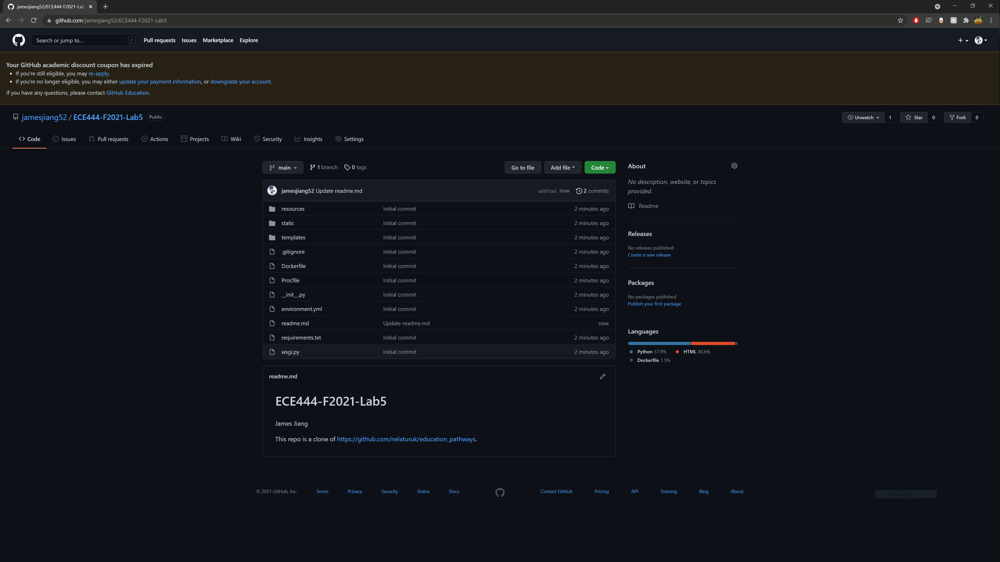
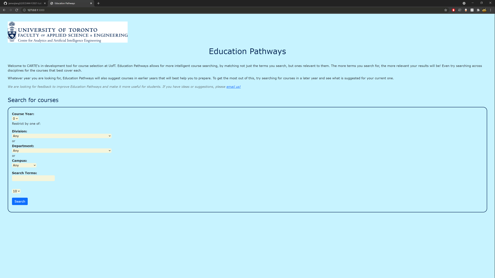
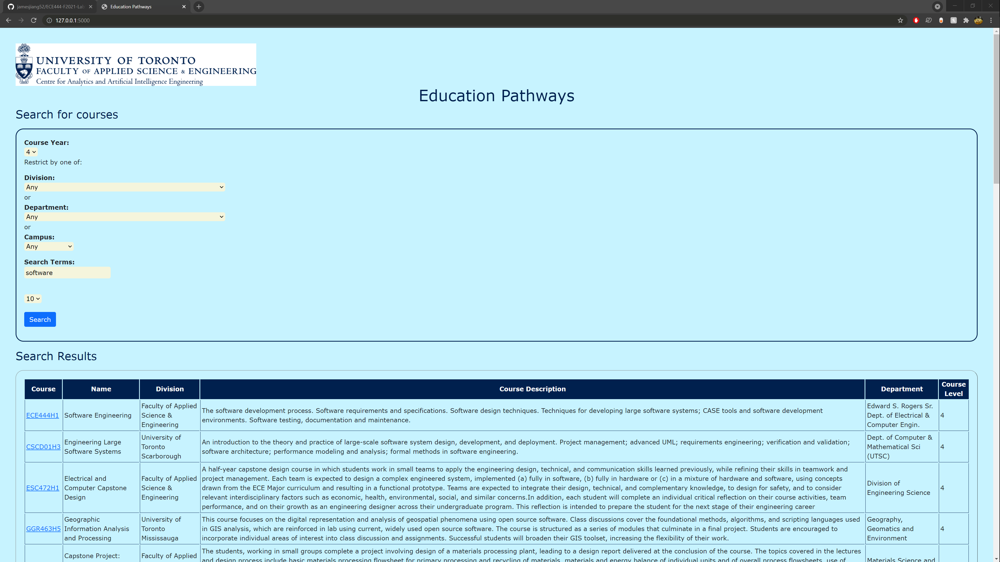
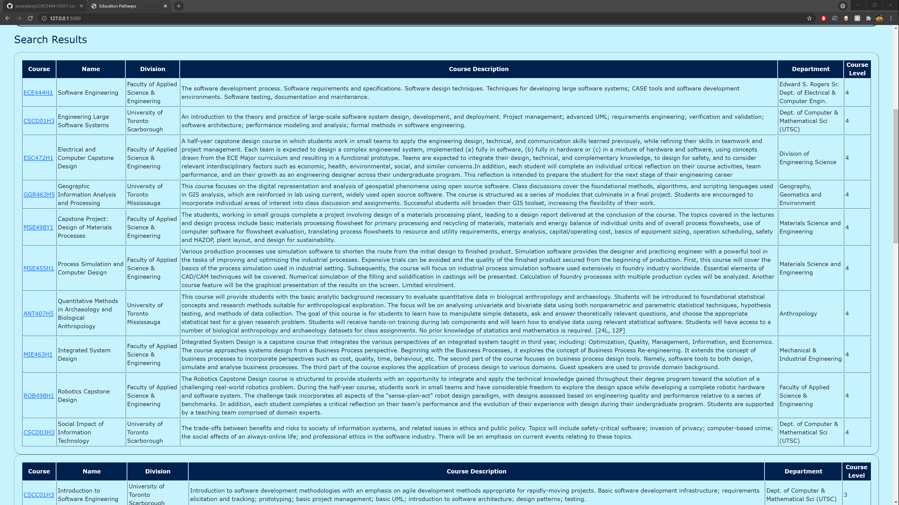

# ECE444-F2021-Lab5

James Jiang

This repo is a clone of https://github.com/nelaturuk/education_pathways.

## Activity 1
Repo in GitHub account:

## Activity 2-5
Home page:

Results page (form):

Results page (results table):

## Activity 6
In the old UI, the table headings were not aligned very well to the table columns, and there was no separation between the rows of the table. In contrast, in the new UI, the table headings are center-aligned to the table columns, and the rows of the table are clearly separated. In addition, the heading row is a much darker color and scrolls along the table, making it much more distinguishable from the other rows. As a result, the new styled UI is much more readable than the old UI.
